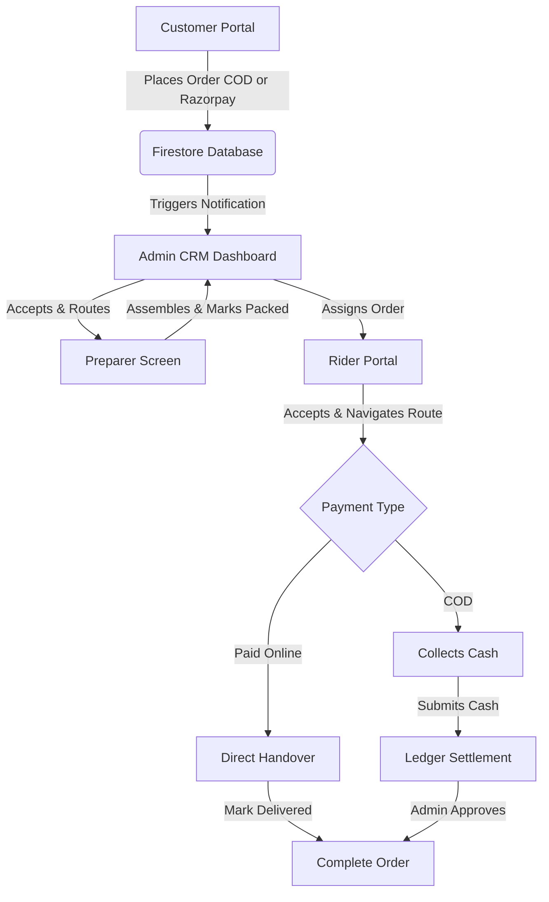

# 🥩 MeatDae - Meat Delivery Web Application

MeatDae is a full-stack, logistics-enabled meat delivery platform built with a micro-portal architecture. Designed as a mini Swiggy/Blinkit system for meat logistics, it offers distinct interfaces for Customers, Delivery Riders, Store Managers, and Kitchen Staff.

---

## 🏗️ System Architecture & Workflow

Below is the workflow showing the journey of an order from placement to delivery:



---

## 📊 Portals & Feature Matrix

The platform is split into four custom interfaces to separate responsibilities:

| Portal | Target User Role | Key Features | Tech Helpers |
| :--- | :--- | :--- | :--- |
| **Customer Portal** | Customers | Homepage sliders, category lists, cart totals, distance fee calculation, checkout geocoding, order tracking. | MapTiler SDK, Firebase Auth, Razorpay |
| **Rider Portal** | Delivery Riders | Delivery status steps, Map navigation, cash collection logging, earnings overview. | MapTiler, Firestore Real-time |
| **Admin CRM/CMS** | Store Managers | Low-stock alerts, revenue reports, courier assignments, promotions/banners management, ledger reconciliation. | Firestore, Node.js |
| **Preparer Portal** | Packaging Staff | Order items lists, package checklist validation, packing triggers. | Firestore Real-time |

---

## 📂 Project Directory Structure

| Path | Type | Description |
| :--- | :--- | :--- |
| [`customer/`](file:///c:/Users/Subhankar%20Roy/Downloads/MeatDae_New/customer) | Directory | HTML views, CSS layout templates, and JS scripts for the client shopping experience. |
| [`staff/`](file:///c:/Users/Subhankar%20Roy/Downloads/MeatDae_New/staff) | Directory | Dashboards for Riders, Preparers, and Admin Managers, plus supporting assets. |
| [`functions/`](file:///c:/Users/Subhankar%20Roy/Downloads/MeatDae_New/functions) | Directory | Firebase Cloud Functions (Node.js 20 serverless backend) for system integrations (Gemini AI Support, Email systems). |
| [`server.js`](file:///c:/Users/Subhankar%20Roy/Downloads/MeatDae_New/server.js) | File | Local development HTTP server to host client and staff web portals concurrently on port `8888`. |
| [`seed_database.js`](file:///c:/Users/Subhankar%20Roy/Downloads/MeatDae_New/seed_database.js) | File | Utility tool to seed default products, category listings, and initial stock quantities. |
| [`firestore.rules`](file:///c:/Users/Subhankar%20Roy/Downloads/MeatDae_New/firestore.rules) | File | Access control security rules for the Cloud Firestore database. |

---

## 🗄️ Database Schema & Collections (Firestore)

| Collection | Scope | Document Properties |
| :--- | :--- | :--- |
| **`users`** | Authentication profiles | `uid`, `name`, `email`, `phone`, `role` (Customer/Rider/Manager), `createdAt` |
| **`products`** | Product catalog | `id`, `name`, `description`, `price`, `salePrice`, `weightVariants` (e.g. 250g, 500g, 1kg), `stock` |
| **`orders`** | Order management | `orderId`, `customerId`, `items` (List), `total`, `status` (Pending -> Delivered), `paymentType` (COD/Razorpay), `address` |
| **`ledger`** | Cash settlements | `id`, `riderId`, `amountCollected`, `type` (COD/Settlement), `status` (Pending/Settled), `timestamp` |
| **`coupons`** | Promotional vouchers | `code`, `discountValue`, `discountType` (percentage/flat), `expiry`, `minOrder` |

---

## ⚙️ Setup & Local Execution

### 1. Configure Firebase App Keys
To link the frontend portals to your Firebase project:
1. Obtain the client web configuration object from your Firebase Console.
2. Overwrite the template configuration block inside:
   - [`customer/js/firebase-config.js`](file:///c:/Users/Subhankar%20Roy/Downloads/MeatDae_New/customer/js/firebase-config.js)
   - [`staff/js/firebase-config.js`](file:///c:/Users/Subhankar%20Roy/Downloads/MeatDae_New/staff/js/firebase-config.js)

### 2. Install Serverless Dependencies
Set up the Firebase Cloud Functions node environment:
```bash
cd functions
npm install
```

### 3. Database Seeding (Firestore)
To populate the database with categories and inventory:
1. Export a **Service Account Private Key JSON** file from the Firebase Console (Project Settings -> Service Accounts).
2. Save it in the project root folder. Name the file: `firebase-service-account.json`. (This file is matching the ignore rules in `.gitignore` and will not be tracked by Git).
3. Run the database seed command:
   ```bash
   node seed_database.js
   ```

### 4. Run Development Server
Boot the web portals locally:
```bash
node server.js
```
Open the following links in your web browser:
*   **Customer Web Portal**: [http://localhost:8888/customer/index.html](http://localhost:8888/customer/index.html)
*   **Staff & Rider Dashboard**: [http://localhost:8888/staff/index.html](http://localhost:8888/staff/index.html)

---

## 🛡️ Security & Credential Rules

> [!IMPORTANT]
> **No sensitive keys, private certificates, or local settings should ever be committed to the repository.**
> The `.gitignore` files are pre-configured to block:
> *   `*.json` files containing service account keys (e.g. `*-firebase-adminsdk-*.json`, `firebase-service-account.json`)
> *   Environment variables files (`.env`, `.env.local`)
> *   Dependency directories (`node_modules/`)
> *   Log files (`*.log`)
